* Deploy infrastructure with terraform
```
terraform init
terraform plan -out terraform.plan
terraform apply terraform.plan
....
terraform destroy
```
* Copy notebook and data into Databricks cluster
* Execute all the steps from "ML End-to-End Example" notebook

* 1 - Merge the two DataFrames into a single dataset, with a new binary feature "is_red" that indicates whether the wine is red or white.
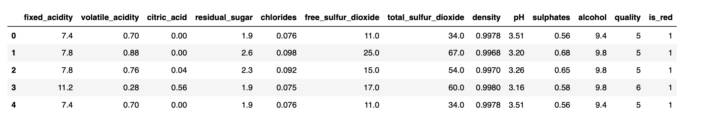
* 2 - Plot a histogram of the dependent variable, quality.
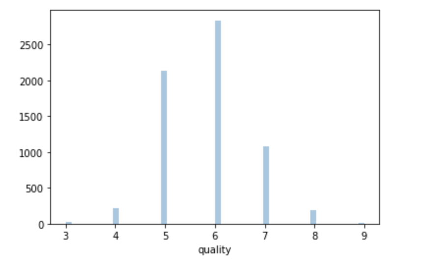
* 3 - Building a box plots to determine correlations between features (fixed_acidity,	volatile_acidity, citric_acid, residual_sugar, chlorides, free_sulfur_dioxide, total_sulfur_dioxide, density, pH, sulphates, alcohol) and wine quality.
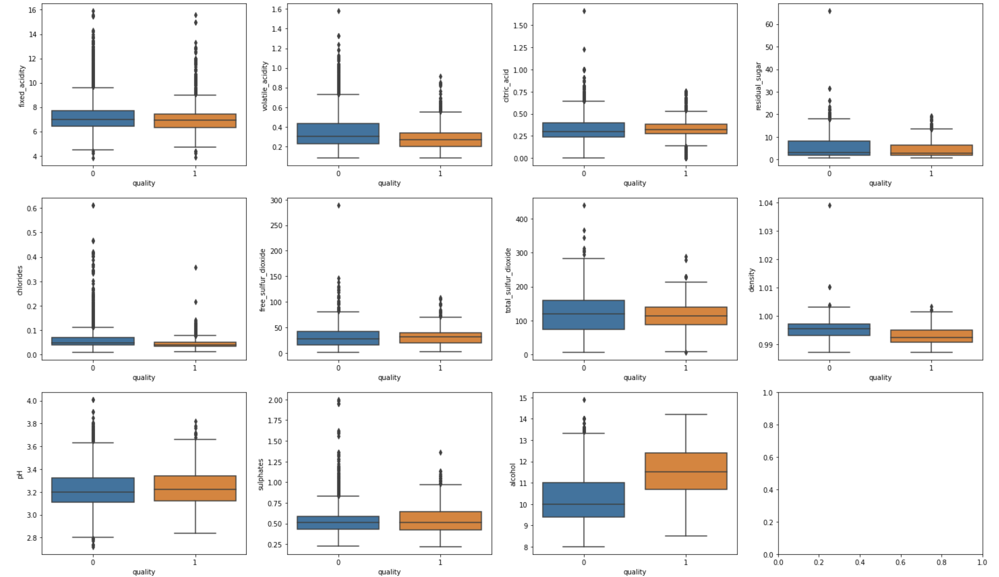
The median alcohol content of high quality wines is greater than even the 75th quantile of low quality wines. High alcohol content is correlated with quality.
Low quality wines have a greater density than high quality wines. Density is inversely correlated with quality.
* 4 - Check for missing values.
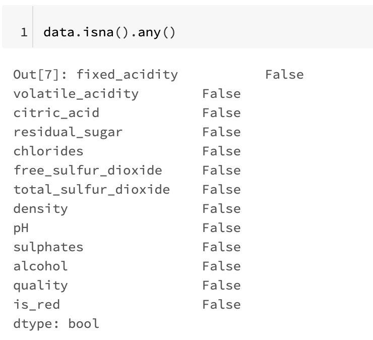 
There are no missing values.
* 5 - Building a Baseline Model, feature importances output by the model as a sanity-check:
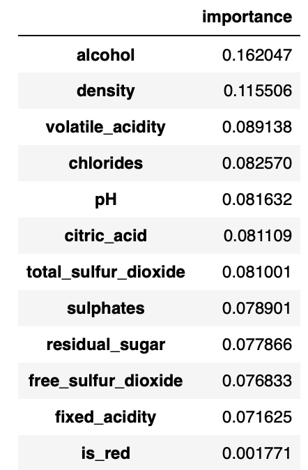 
Both alcohol and density are important in predicting quality.
* 6 - The experiment result: wine-quality model.
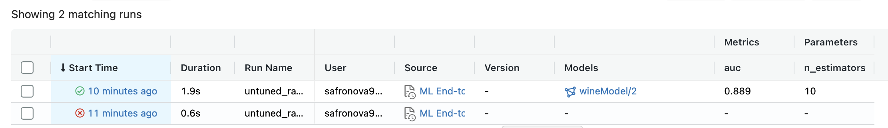 
* 7 -  Transition this model to production and load it into this notebook from the model registry.
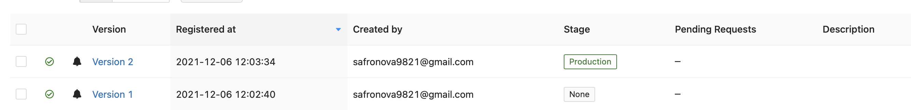 
* 8 - After registering the model in MLFlow and running a hyperparameter sweep, observed the following results, with the highest AUC number being 0.92:
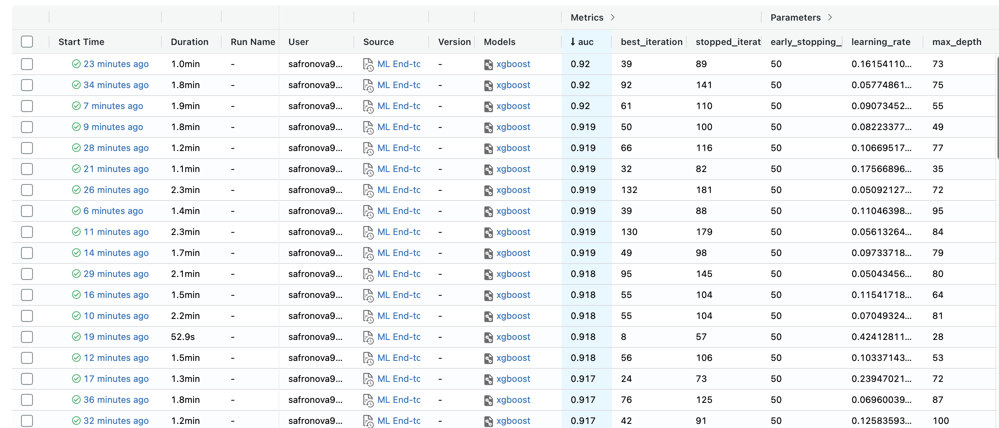  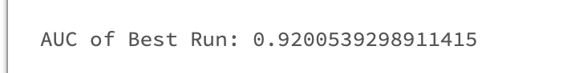 
* 9 - Generate the Parallel Coordinates Plot, by comparing different runs we see the impact of parameters on a metric
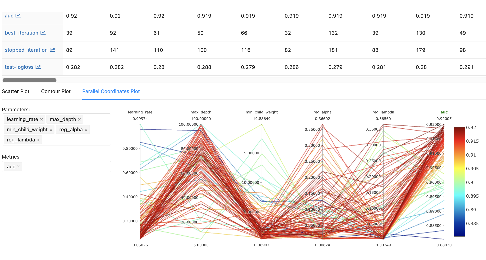
* 10 -  The model on data stored in a Delta table, using Spark to run the computation in parallel. Load the model into a Spark UDF, so it can be applied to the Delta table.
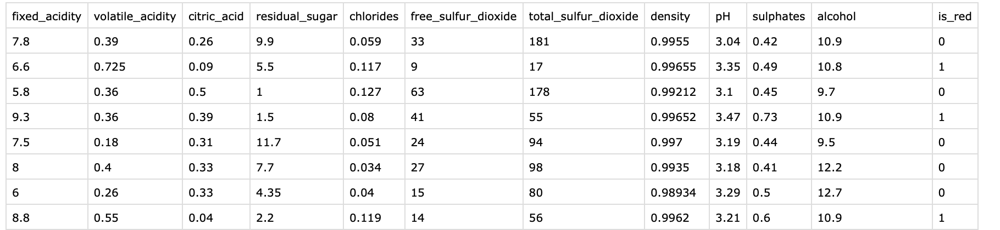
* 11 - After upgrading the model to Production, we serve it and compare model prediction ( The model predictions from the endpoint should agree with the results from locally evaluating the model.)
 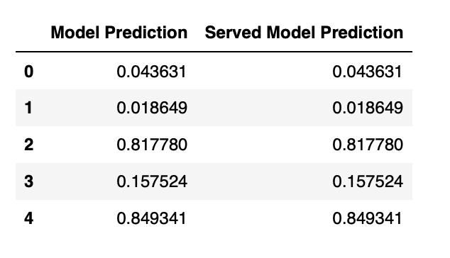   
